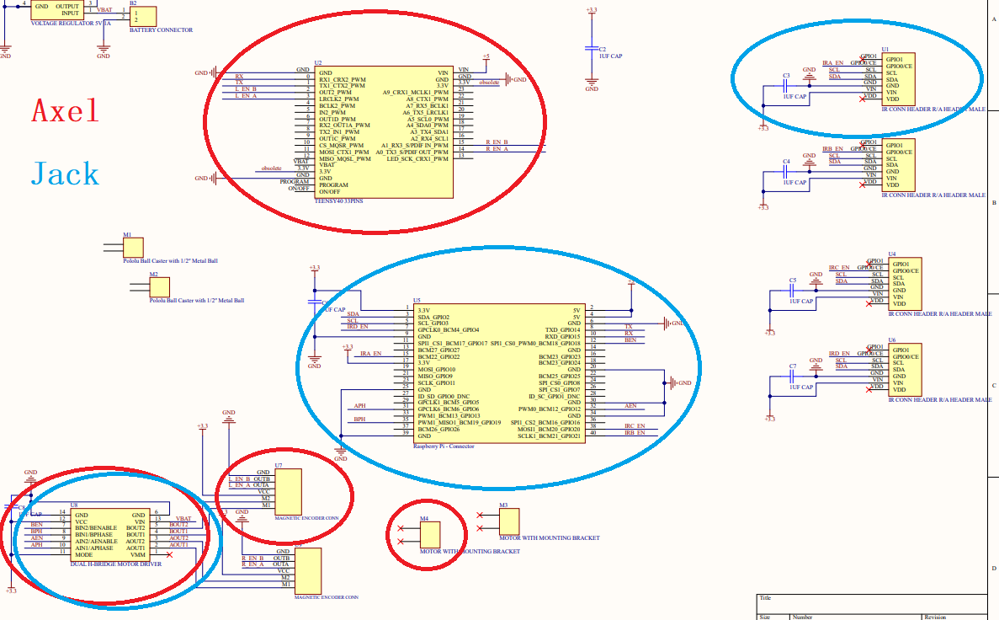

# **Schedule**

## **Directions**

- Hardware: 
  - Axel: Teensy4.0, Magnetic encoder, Motor driver, Motor
  - Jack: RaspberryPi, Motor driver, IR sensors
- Software: 
  - Ines: Server side
  - Jack: GameEngine host side and RaspberryPi

For the hardware, refer to [our PCB schematic](./Docs/Hardware/Altium/PacBot.pdf) for component connections.

## **Reference**
[2022 UCLA Micromouse tutorial](https://www.youtube.com/watch?v=UHWE3d_au30&list=PLAWsHzw_h0iiPIaGyXAr44G0XfHfyjOe7): mechanisms about components we will use, including battery/power, motors, magnetic encoders, PID control, IR sensors, and PCB design tips. Suggest to watch Lecture 1 Battery Safety and Usage (4:24-6:37) before touching the LiPo batteries. It will literally explode.

[RaspberryPi Datasheets](https://datasheets.raspberrypi.com/)

[Beginners Guide to LiPo Batteries for FPV Drones](https://fpvfc.org/beginners-guide-to-lipo-batteries#:~:text=LiPo%20Cell%20Voltage&text=The%20usable%20voltage%20range%20for,a%20battery%20bursting%20into%20flames.)

[L7805 voltage regulator](https://www.mouser.com/ProductDetail/STMicroelectronics/L7805ACD2T-TR?qs=Ctxo64yJVFuOLXlPPZdJUQ%3D%3D)

[50:1 Micro Metal Gearmotor MP 6V with Extended Motor Shaft](https://www.pololu.com/product/2379/resources)

[Teensy 4.0](https://www.pjrc.com/store/teensy40.html)

[DRV8835 motor driver](https://www.pololu.com/product/2135)

[Magnetic encoder](https://www.pololu.com/product/3081)

[VL6180X IR sensor](https://www.pololu.com/product/2489)

[Altium Designer PCB Design Tutorial for Beginners (v20 and 21)](https://www.youtube.com/watch?v=KpgRl28C018&list=PLDclr_SCaTAxEpaE0uf9RDQUNtW5YSoxW)

## **Timeline**

[X] Week 1: Mar 6 - Mar 12

[X] Week 2: Mar 12 - Mar 19

[X] Week 3: Mar 19 - Mar 26

Hardware prototype ddl

[ ] Week 4: Mar 26 - Apr 2

[ ] Week 5: Apr 2 - Apr 9

Running PacMan ddl

[ ] Week 6: Apr 9 - Apr 16

[ ] Week 7: Apr 16 - Apr 23

Testing ddl

Competition: Apr 23
